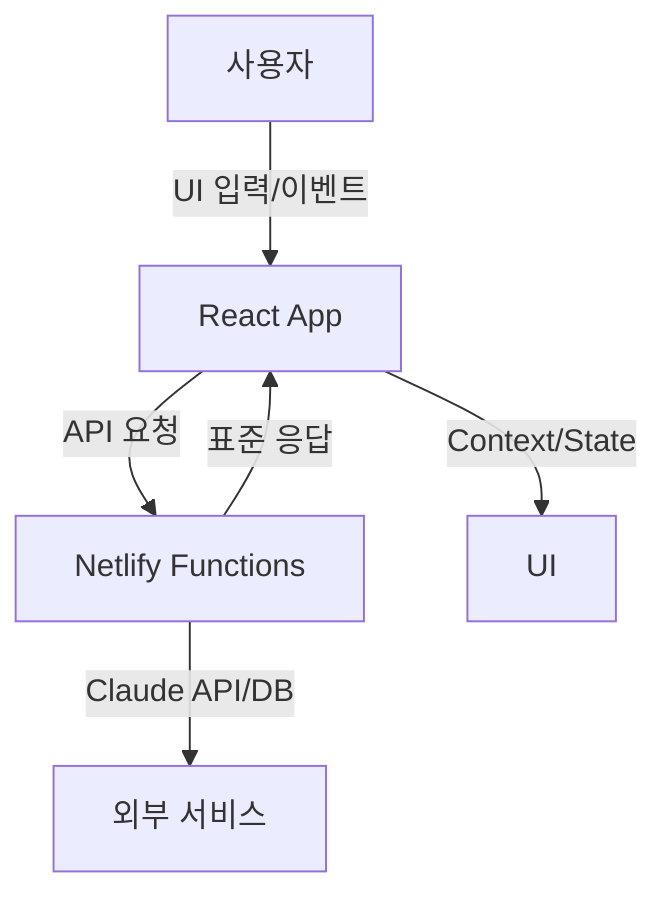

# TextPerfect 프로젝트 아키텍처

## 전체 폴더 구조

```
TextPerfect/
├── src/
│   ├── components/      # UI 컴포넌트(공통, 레이아웃, 기능별)
│   ├── contexts/        # React Context 전역 상태 관리
│   ├── hooks/           # 커스텀 React 훅
│   ├── utils/           # 유틸리티 함수/헬퍼
│   ├── constants/       # 상수, 테마, 디자인 시스템
│   ├── types/           # 타입 정의(TypeScript)
│   ├── styles/          # 글로벌/공통 스타일
│   └── pages/           # 라우트별 페이지 컴포넌트
├── netlify/functions/   # 서버리스 API(Netlify Functions)
├── public/              # 정적 파일(HTML, manifest 등)
├── docs/                # 프로젝트 문서
├── package.json         # 의존성/스크립트
└── ...
```

## 폴더별 역할과 책임
- **components/**: 공통/기능별 UI, 레이아웃, 재사용 컴포넌트
- **contexts/**: 사용자, 앱, 분석 등 전역 상태 관리
- **hooks/**: useApi, useLocalStorage 등 커스텀 훅
- **utils/**: API, 에러, 스토리지 등 헬퍼 함수
- **constants/**: 컬러, 디자인, 상수, 엔드포인트 등
- **types/**: 타입스크립트 타입(확장 예정)
- **styles/**: 글로벌 CSS, Tailwind 설정
- **pages/**: 각 라우트별 페이지(대시보드, 에디터 등)
- **netlify/functions/**: 서버리스 백엔드(API, 인증, Claude 연동 등)
- **docs/**: 아키텍처, API, 컴포넌트, 개발 가이드 등 문서

## 데이터 플로우 다이어그램



- **설명**: 사용자는 React App을 통해 입력/이벤트를 발생시키고, 프론트엔드는 Netlify Functions로 API 요청을 보냅니다. Functions는 Claude API 등 외부 서비스와 통신 후 표준화된 응답을 반환하며, 프론트엔드는 Context/State를 통해 UI를 갱신합니다. 