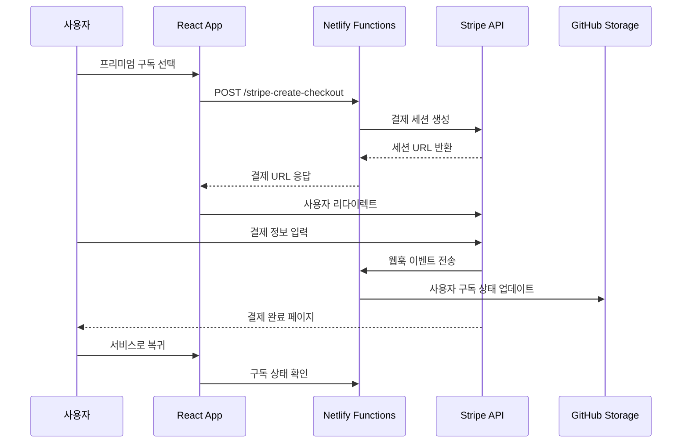
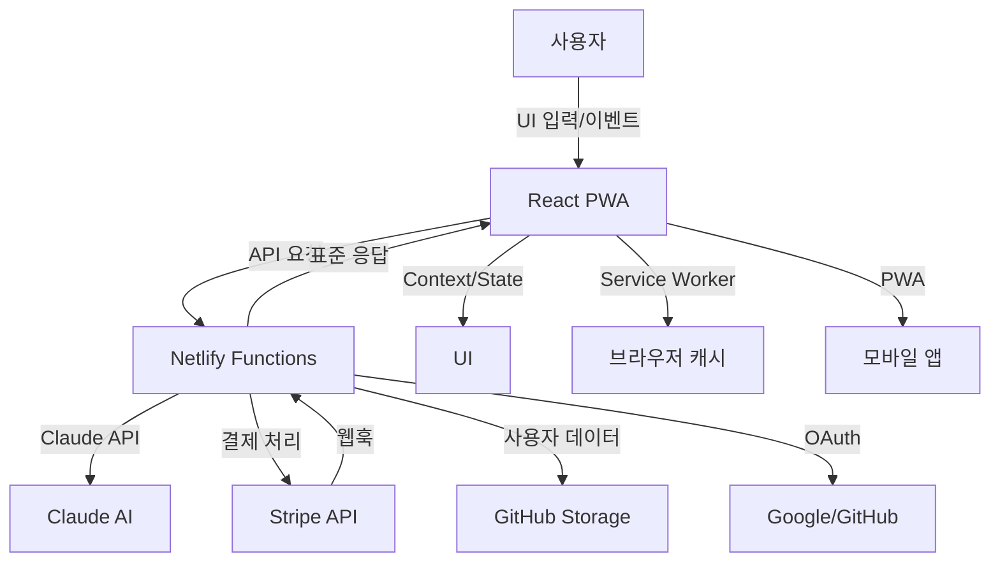

# TextPerfect 프로젝트 아키텍처 (C단계 Phase 3 완성)

## 전체 폴더 구조

```
TextPerfect/
├── src/
│   ├── components/      # UI 컴포넌트 (공통, 레이아웃, 기능별, PWA)
│   ├── contexts/        # React Context 전역 상태 관리
│   ├── hooks/           # 커스텀 React 훅
│   ├── utils/           # 유틸리티 함수/헬퍼 (PWA 유틸리티 포함)
│   ├── constants/       # 상수, 테마, 디자인 시스템
│   ├── types/           # 타입 정의(TypeScript)
│   └── pages/           # 라우트별 페이지 컴포넌트 (커뮤니티 포함)
├── netlify/functions/   # 서버리스 API (결제, 인증, 커뮤니티)
│   ├── optimize.js      # Claude API 최적화
│   ├── stripe-*.js      # Stripe 결제 시스템
│   ├── auth-*.js        # 인증 시스템 (JWT + OAuth)
│   ├── save-analysis.js # 분석 결과 저장
│   ├── get-*.js         # 데이터 조회 APIs
│   └── utils/           # 공통 유틸리티
├── public/              # 정적 파일 (HTML, manifest, SW)
│   ├── manifest.json    # PWA 매니페스트
│   ├── sw.js           # Service Worker
│   └── offline.html    # 오프라인 페이지
├── docs/                # 프로젝트 문서
├── scripts/             # 개발/배포 스크립트
└── ...
```

## 폴더별 역할과 책임

### 프론트엔드 구조
- **components/**: 공통/기능별 UI, 레이아웃, 재사용 컴포넌트, PWA 컴포넌트
- **contexts/**: 사용자, 앱, 분석 등 전역 상태 관리
- **hooks/**: useApi, useLocalStorage, useStripe 등 커스텀 훅
- **utils/**: API, 에러, 스토리지, Stripe 클라이언트, **PWA 유틸리티** 등
- **constants/**: 컬러, 디자인, 상수, 엔드포인트 등
- **types/**: 타입스크립트 타입(확장 예정)
- **pages/**: 각 라우트별 페이지 + **커뮤니티 페이지**

### 백엔드 구조 (Netlify Functions)
- **optimize.js**: Claude API 최적화 Functions
- **stripe-*.js**: Stripe 결제 시스템 Functions
- **auth-*.js**: 인증 관련 Functions (JWT + OAuth)
- **save-analysis.js**: 분석 결과 저장 (GitHub Storage)
- **get-analysis-history.js**: 히스토리 조회
- **get-challenges.js**: 커뮤니티 챌린지 조회
- **get-leaderboard.js**: 리더보드 조회
- **get-user-stats.js**: 사용자 통계 조회
- **utils/**: 공통 유틸리티 (response.js, github-storage.js)

### PWA 구조
- **public/manifest.json**: PWA 매니페스트 (앱 설치 정보)
- **public/sw.js**: Service Worker (캐싱, 오프라인 지원)
- **public/offline.html**: 오프라인 페이지
- **src/utils/pwa.js**: PWA 유틸리티 함수들
- **src/components/common/PWAInstallButton.jsx**: 앱 설치 버튼

## 사용자 유형별 서비스 아키텍처 (C단계 완성)

### 🚶‍♂️ 비회원 (GUEST)
- **제한**: 500자, 기본 최적화만 (Claude-3-Haiku, 500토큰)
- **접근**: 에디터만, 템플릿/AI코치/구독/커뮤니티 차단
- **저장**: 로컬 스토리지만 사용

### 🆓 무료 플랜 (FREE)
- **제한**: 1,000자/일, 10개/월
- **AI**: Claude-3-Haiku, 1000토큰 (기본 최적화 + 가독성)
- **기능**: 기본 템플릿 3개, 기본 AI 코치 1개, 커뮤니티 참여
- **구독**: 프리미엄 업그레이드 가능

### 💎 프리미엄 플랜 (PREMIUM)
- **제한**: 10,000자/일, 100개/월
- **AI**: Claude-3-Sonnet, 2000토큰 (고급 분석 + 상세 피드백)
- **기능**: 모든 템플릿 6개, 모든 AI 코치 4개, 전체 커뮤니티 기능
- **구독**: 월간 ₩9,900 / 연간 ₩99,000

## PWA 아키텍처 (C단계 Phase 3 핵심)

### Service Worker 구조
```javascript
// 캐시 전략
- API 요청: NetworkFirst (네트워크 우선, 캐시 백업)
- 정적 리소스: CacheFirst (캐시 우선, 백그라운드 업데이트)
- HTML 페이지: NetworkFirst (오프라인 시 fallback)

// 백그라운드 동기화
- 분석 결과 저장: 오프라인 시 IndexedDB 저장 후 온라인 시 동기화
- 푸시 알림: 분석 완료, 챌린지 알림 등
```

### PWA 기능
- **앱 설치**: beforeinstallprompt 이벤트 처리
- **오프라인 지원**: 캐시된 데이터로 기본 기능 제공
- **백그라운드 동기화**: 네트워크 복구 시 자동 데이터 동기화
- **푸시 알림**: 웹 알림 API 활용

## 커뮤니티 시스템 아키텍처

### 챌린지 시스템
```javascript
challengeStructure = {
  id: 'challenge-1',
  title: '30일 연속 글쓰기 챌린지',
  type: 'consecutive', // consecutive, count, score
  target: 30,
  participants: 1247,
  reward: '글쓰기 마스터 배지',
  progress: {
    current: 15,
    target: 30
  }
}
```

### 리더보드 시스템
```javascript
leaderboardEntry = {
  userId: 'user-1',
  nickname: '글쓰기마스터',
  documents: 45,
  averageScore: 92,
  totalScore: 4140,
  badges: 5,
  rank: 1
}
```

### 사용자 통계 시스템
```javascript
userStats = {
  documentsThisMonth: 23,
  averageScore: 87,
  rank: 15,
  badges: 3,
  streakDays: 7,
  recentAchievements: [...]
}
```

## 결제 시스템 아키텍처 (C단계 Phase 1 완성)

### Stripe 결제 플로우


## 데이터 플로우 다이어그램



### 주요 데이터 흐름
1. **텍스트 최적화**: User → Frontend → Netlify → Claude → 응답 반환
2. **결제 처리**: User → Frontend → Netlify → Stripe → 웹훅 → 상태 업데이트
3. **분석 저장**: 최적화 완료 → GitHub Storage → 히스토리 업데이트
4. **커뮤니티**: 챌린지 참여 → 진행률 업데이트 → 리더보드 반영
5. **PWA**: 오프라인 → IndexedDB 저장 → 온라인 복구 → 동기화

## 보안 및 인증 구조

### JWT + OAuth 인증
- **JWT 토큰**: 로컬 스토리지 (7일 만료)
- **OAuth 지원**: Google, GitHub
- **권한 검증**: 모든 API 요청 시 Bearer 토큰 확인
- **자동 갱신**: 토큰 만료 시 재로그인 유도

### 데이터 보안
- **GitHub Storage**: 사용자별 암호화된 데이터 저장
- **Stripe 보안**: 웹훅 서명 검증, PCI 준수
- **CORS 설정**: 적절한 도메인 제한

## 환경 변수 관리

### 필수 환경 변수
```bash
# AI 서비스
CLAUDE_API_KEY=your_claude_api_key_here

# Stripe 결제 시스템
STRIPE_SECRET_KEY=sk_test_...
STRIPE_PUBLISHABLE_KEY=pk_test_...
STRIPE_WEBHOOK_SECRET=whsec_...

# GitHub Storage
GITHUB_TOKEN=ghp_...
GITHUB_REPO_OWNER=textperfect-data
GITHUB_REPO_NAME=user-data

# JWT 인증
JWT_SECRET=your-super-secret-jwt-key-here

# OAuth (선택적)
GOOGLE_CLIENT_ID=...
GOOGLE_CLIENT_SECRET=...
GITHUB_CLIENT_ID=...
GITHUB_CLIENT_SECRET=...

# 프론트엔드용
REACT_APP_STRIPE_PUBLISHABLE_KEY=pk_test_...
```

## 성능 최적화

### 프론트엔드 최적화
- **코드 스플리팅**: 페이지별 lazy loading
- **PWA 캐싱**: Service Worker를 통한 적극적 캐싱
- **메모이제이션**: React.memo, useMemo 활용
- **번들 최적화**: Webpack 설정 최적화

### 백엔드 최적화
- **응답 캐싱**: 동일 요청에 대한 캐시 처리
- **에러 핸들링**: 표준화된 에러 응답
- **로깅**: 중요 이벤트 추적 및 모니터링

### PWA 최적화
- **캐시 전략**: 리소스별 최적화된 캐싱 전략
- **오프라인 지원**: 핵심 기능의 오프라인 사용 가능
- **백그라운드 동기화**: 네트워크 복구 시 자동 동기화

## 확장성 고려사항

### 수평 확장
- **서버리스 아키텍처**: Netlify Functions 자동 스케일링
- **상태 비저장**: JWT 토큰 기반 무상태 API
- **외부 의존성**: Stripe, Claude API, GitHub 활용
- **PWA**: 클라이언트 사이드 캐싱으로 서버 부하 감소

### 향후 확장 계획
- **실시간 기능**: WebSocket 또는 Server-Sent Events
- **다국어 지원**: i18n 국제화
- **고급 분석**: 머신러닝 기반 개인화
- **협업 기능**: 실시간 공동 편집 