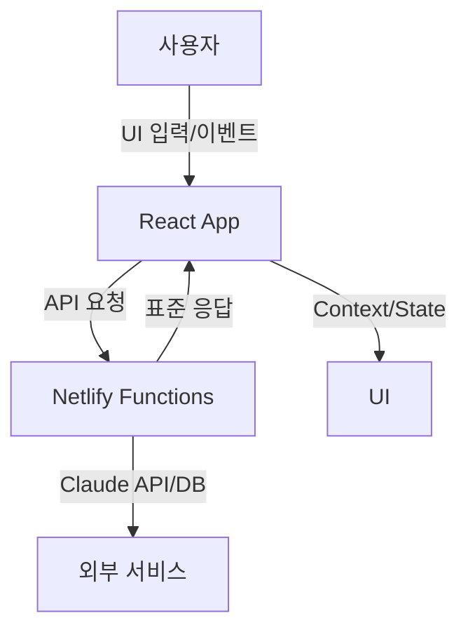

# TextPerfect 프로젝트 아키텍처 (B단계 완성)

## 전체 폴더 구조

```
TextPerfect/
├── src/
│   ├── components/      # UI 컴포넌트(공통, 레이아웃, 기능별)
│   ├── contexts/        # React Context 전역 상태 관리 (사용자 유형별 제한 포함)
│   ├── hooks/           # 커스텀 React 훅
│   ├── utils/           # 유틸리티 함수/헬퍼
│   ├── constants/       # 상수, 테마, 디자인 시스템
│   ├── types/           # 타입 정의(TypeScript)
│   └── pages/           # 라우트별 페이지 컴포넌트 (사용자 제한 적용)
├── netlify/functions/   # 서버리스 API (Claude API 최적화 포함)
│   ├── optimize.js      # Claude API 최적화 (사용자 유형별 차별화)
│   └── utils/           # 공통 유틸리티 (response.js)
├── public/              # 정적 파일(HTML, manifest 등)
├── docs/                # 프로젝트 문서
├── scripts/             # 개발/배포 스크립트 (환경 변수 체크 포함)
├── package.json         # 의존성/스크립트
└── ...
```

## 폴더별 역할과 책임
- **components/**: 공통/기능별 UI, 레이아웃, 재사용 컴포넌트
- **contexts/**: 사용자, 앱, 분석 등 전역 상태 관리 + **월 문서 수 추적 시스템**
- **hooks/**: useApi, useLocalStorage 등 커스텀 훅
- **utils/**: API, 에러, 스토리지 등 헬퍼 함수
- **constants/**: 컬러, 디자인, 상수, 엔드포인트 등
- **types/**: 타입스크립트 타입(확장 예정)
- **pages/**: 각 라우트별 페이지 + **사용자 유형별 기능 제한 UI**
- **netlify/functions/**: 서버리스 백엔드 + **Claude API 최적화 Functions**
- **docs/**: 아키텍처, API, 컴포넌트, 개발 가이드 등 문서

## 사용자 유형별 서비스 아키텍처 (B단계 핵심)

### 🚶‍♂️ 비회원 (GUEST)
- **제한**: 500자, 기본 최적화만 (Claude-3-Haiku, 500토큰)
- **접근**: 에디터만, 템플릿/AI코치 차단
- **저장**: 로컬 스토리지만 사용

### 🆓 무료 플랜 (FREE)
- **제한**: 3,000자, 1,000자/일, 10개/월
- **AI**: Claude-3-Haiku, 1000토큰 (기본 최적화 + 가독성)
- **기능**: 기본 템플릿 3개, 기본 AI 코치 1개

### 💎 프리미엄 플랜 (PREMIUM)
- **제한**: 10,000자, 10,000자/일, 100개/월
- **AI**: Claude-3-Sonnet, 2000토큰 (고급 분석 + 상세 피드백)
- **기능**: 모든 템플릿 6개, 모든 AI 코치 4개 + 개인 맞춤 피드백

## 데이터 플로우 다이어그램



- **설명**: 사용자는 React App을 통해 입력/이벤트를 발생시키고, 프론트엔드는 Netlify Functions로 API 요청을 보냅니다. Functions는 Claude API 등 외부 서비스와 통신 후 표준화된 응답을 반환하며, 프론트엔드는 Context/State를 통해 UI를 갱신합니다. 