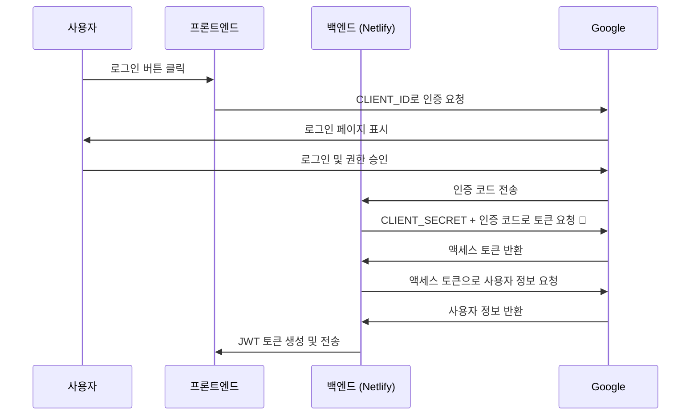

# 🔐 TextPerfect 환경 변수 설정 가이드

## 개요

TextPerfect 프로젝트는 다양한 외부 서비스와 연동되어 작동합니다. 이 문서는 프로젝트에 필요한 모든 환경 변수들과 GitHub Secrets 설정 방법을 상세히 안내합니다.

## 🎯 환경 변수 분류

### 필수 환경 변수 (Required)
프로젝트의 핵심 기능을 위해 반드시 설정해야 하는 변수들입니다.

### 선택적 환경 변수 (Optional)
추가 기능(소셜 로그인 등)을 위한 변수들로, 없어도 기본 기능은 작동합니다.

### 시스템 환경 변수 (System)
Netlify에서 자동으로 설정되는 변수들입니다.

---

## 📋 필수 환경 변수 목록

### 1. AI 서비스
```bash
CLAUDE_API_KEY=sk-ant-api03-...
```
- **용도**: Claude AI를 통한 텍스트 최적화 및 분석
- **획득 방법**: [Anthropic Console](https://console.anthropic.com/) → API Keys
- **형식**: `sk-ant-api03-` 로 시작하는 키
- **보안 수준**: 🔴 극비 (API 사용량 과금)

### 2. JWT 인증
```bash
JWT_SECRET=your-super-secret-jwt-key-here-2024
```
- **용도**: 사용자 인증 토큰 암호화/복호화
- **생성 방법**: 최소 32자 이상의 랜덤 문자열
- **예시**: `textperfect-jwt-secret-2024-ultra-secure-random-string`
- **보안 수준**: 🔴 극비 (사용자 인증 우회 가능)

### 3. GitHub Storage (데이터 저장)
```bash
DATA_REPO_TOKEN=ghp_...
DATA_REPO_OWNER=your-github-username
DATA_REPO_NAME=TextPerfect-userdata
```
- **용도**: 사용자 데이터 및 분석 기록 저장
- **DATA_REPO_TOKEN 획득**:
  1. GitHub → Settings → Developer settings → Personal access tokens → Tokens (classic)
  2. Generate new token (classic)
  3. Scopes: `repo` (Full control of private repositories) 선택
  4. 생성된 토큰을 복사 (한 번만 표시됨)
- **저장소 설정**: `TextPerfect-userdata` 레포지토리 생성 필요 (Private 권장)
- **보안 수준**: 🔴 극비 (저장소 전체 접근)
- **주의사항**: Secret names는 `GITHUB_`로 시작할 수 없음

### 4. 토스페이먼츠 결제 시스템 (현재 적용됨)
```bash
# 백엔드용 (GitHub Secrets에 필수)
TOSS_SECRET_KEY=test_sk_... (또는 live_sk_...)

# 프론트엔드용 (GitHub Secrets에 필수)
TOSS_CLIENT_KEY=test_ck_... (또는 live_ck_...)
REACT_APP_TOSS_CLIENT_KEY=test_ck_... (또는 live_ck_...)
```
- **용도**: 구독 결제 및 관리 (한국형 결제 시스템)
- **획득 방법**: [토스페이먼츠 개발자센터](https://developers.tosspayments.com/) → API 키 관리
- **환경별 구분**:
  - 개발/테스트: `test_sk_`, `test_ck_`
  - 프로덕션: `live_sk_`, `live_ck_`
- **보안 수준**: 🔴 극비 (결제 정보 접근)
- **상태**: ⏳ **추후 토스페이먼츠 가입 후 입력 예정**

### 5. Stripe 결제 시스템 (미사용 - 참고용)
```bash
# 현재 사용하지 않음 (토스페이먼츠로 대체)
# STRIPE_SECRET_KEY=sk_test_...
# STRIPE_PUBLISHABLE_KEY=pk_test_...
# REACT_APP_STRIPE_PUBLISHABLE_KEY=pk_test_...
# STRIPE_WEBHOOK_SECRET=whsec_...
```
- **상태**: ❌ **사용 안 함** (토스페이먼츠로 대체됨)

---

## 🔗 선택적 환경 변수 목록

### 5. Google OAuth (소셜 로그인) - 현재 적용됨
```bash
# 백엔드용 (GitHub Secrets에 필수 🔴)
GOOGLE_CLIENT_SECRET=GOCSPX-very-secret-key
GOOGLE_REDIRECT_URI=https://textperfect.netlify.app/auth/google/callback

# 프론트엔드용 (GitHub Secrets에 설정됨)
GOOGLE_CLIENT_ID=379125371254-5tdkum8h1udol3so59v0r8o4ogmj9bc4.apps.googleusercontent.com
REACT_APP_GOOGLE_CLIENT_ID=379125371254-5tdkum8h1udol3so59v0r8o4ogmj9bc4.apps.googleusercontent.com
```
- **용도**: Google 계정으로 로그인
- **상태**: ✅ **설정 완료** (OAuth 범위 설정 필요)
- **CLIENT_SECRET이 중요한 이유**:
  - 인증 코드를 액세스 토큰으로 교환할 때 필요
  - 노출 시 악의적 사용자가 앱을 가장할 수 있음
  - Google API 할당량 악용 가능
- **획득 방법**:
  1. [Google Cloud Console](https://console.cloud.google.com/)
  2. APIs & Services → Credentials
  3. Create Credentials → OAuth client ID
  4. Application type: Web application
  5. Authorized redirect URIs 설정
- **보안 수준**: 🔴 극비 (CLIENT_SECRET), 🟢 공개 가능 (CLIENT_ID)

### 6. GitHub OAuth (소셜 로그인) - 현재 적용됨
```bash
# 백엔드용 (GitHub Secrets에 필수 🔴)
OAUTH_CLIENT_SECRET=1234567890abcdef...

# 프론트엔드용 (GitHub Secrets에 설정됨)
OAUTH_CLIENT_ID=Iv1.1234567890abcdef
REACT_APP_GITHUB_CLIENT_ID=Iv1.1234567890abcdef
```
- **용도**: GitHub 계정으로 로그인
- **상태**: ⏳ **GitHub OAuth 앱 등록 후 실제 값 입력 예정**
- **CLIENT_SECRET이 중요한 이유**:
  - OAuth 토큰 교환 과정에서 앱 신원 확인
  - 노출 시 사용자 정보 탈취 위험
  - GitHub API 남용 가능
- **획득 방법**:
  1. GitHub → Settings → Developer settings → OAuth Apps
  2. New OAuth App
  3. Authorization callback URL: `https://textperfect.netlify.app/auth/github/callback`
- **보안 수준**: 🔴 극비 (CLIENT_SECRET), 🟢 공개 가능 (CLIENT_ID)

---

## ⚙️ 시스템 환경 변수

### Netlify 자동 설정
```bash
URL=https://your-domain.netlify.app
NETLIFY=true
NODE_ENV=production
```
- **설명**: Netlify에서 자동으로 설정되는 변수들
- **수동 설정 불필요**: 배포 시 자동 생성

---

## 🚀 GitHub Secrets 설정 가이드

### 1. GitHub Repository 설정 경로
```
Repository → Settings → Secrets and variables → Actions → New repository secret
```

### 2. 우선순위별 설정 순서

#### **Phase 1: 핵심 기능 (즉시 필요)**
1. `CLAUDE_API_KEY` - AI 텍스트 최적화
2. `JWT_SECRET` - 사용자 인증
3. `GITHUB_TOKEN` - 데이터 저장
4. `GITHUB_OWNER` - 데이터 저장소 소유자
5. `GITHUB_REPO` - 데이터 저장소 이름

#### **Phase 2: 결제 시스템 (구독 기능)**
6. `TOSS_SECRET_KEY` - 결제 처리
7. `TOSS_CLIENT_KEY` - 프론트엔드 결제
8. `REACT_APP_TOSS_CLIENT_KEY` - React 앱용

#### **Phase 3: 소셜 로그인 (편의 기능)**
9. `GOOGLE_CLIENT_SECRET` - Google OAuth 인증 🔴
10. `GOOGLE_REDIRECT_URI` - Google 콜백 URL
11. `OAUTH_CLIENT_SECRET` - GitHub OAuth 인증 🔴
12. `REACT_APP_GOOGLE_CLIENT_ID` - React 앱용 Google ID
13. `REACT_APP_GITHUB_CLIENT_ID` - React 앱용 GitHub ID

> **💡 참고**: CLIENT_ID는 공개되어도 상관없지만, 환경별 관리의 일관성을 위해 GitHub Secrets에 포함하는 것을 권장합니다.

### 3. 설정 예시
```
Name: GOOGLE_CLIENT_SECRET
Secret: GOCSPX-your-actual-secret-here
```

---

## 🔍 OAuth 보안 이해하기

### OAuth 인증 흐름에서 SECRET의 역할


### CLIENT_SECRET 노출 시 위험성
```bash
# 악의적 사용자가 할 수 있는 일
1. 가짜 앱을 만들어 사용자 정보 탈취
2. 우리 앱의 API 할당량 소진
3. 사용자들을 가짜 로그인 페이지로 유도
4. 브랜드 신뢰도 손상 및 보안 사고

# 실제 공격 시나리오
curl -X POST https://oauth2.googleapis.com/token \
  -d "client_id=OUR_CLIENT_ID" \
  -d "client_secret=LEAKED_SECRET" \  # 🔴 노출된 시크릿
  -d "code=STOLEN_AUTH_CODE" \
  -d "grant_type=authorization_code"
```

---

## 🛡️ 보안 모범 사례

### 절대 공개하면 안 되는 키들
- ❌ `CLAUDE_API_KEY` - API 사용량 과금
- ❌ `TOSS_SECRET_KEY` - 결제 정보 접근
- ❌ `JWT_SECRET` - 사용자 인증 우회 가능
- ❌ `GITHUB_TOKEN` - 저장소 전체 접근
- ❌ `*_CLIENT_SECRET` - OAuth 앱 권한 탈취 🔴
- ❌ `REACT_APP_TOSS_CLIENT_KEY` - 결제 검증 우회

### 공개되어도 상관없지만 관리상 보호하는 키들
- 🟡 `*_CLIENT_ID` - 공개 가능하지만 환경별 관리 필요
- 🟡 `REACT_APP_TOSS_CLIENT_KEY` - 공개 가능하지만 환경별 관리 필요

### 안전한 키 관리
- ✅ 정기적인 키 로테이션 (3-6개월)
- ✅ 최소 권한 원칙 적용
- ✅ 개발/프로덕션 환경 분리
- ✅ 키 사용량 모니터링
- ✅ OAuth 앱 도메인 제한 설정

### 환경별 키 구분
- **개발환경**: `test_sk_`, `test_ck_` (토스페이먼츠 테스트 키)
- **스테이징**: 프로덕션과 별도 키 사용
- **프로덕션**: `live_sk_`, `live_ck_` (토스페이먼츠 라이브 키)

---

## 🔍 설정 확인 방법

### 1. 환경 변수 체크 스크립트
```bash
npm run check-env
```
- 위치: `scripts/check-env.js`
- 기능: 모든 필수 환경 변수 설정 상태 확인
- 실행 시점: Netlify 배포 시 자동 실행

### 2. 수동 확인 방법
```bash
# Netlify Functions에서 환경 변수 확인
curl https://your-domain.netlify.app/.netlify/functions/debug
```

### 3. 로그 확인
- Netlify Functions → 로그에서 환경 변수 로딩 상태 확인
- 민감한 정보는 마스킹되어 표시됨

---

## 🚨 문제 해결

### 자주 발생하는 문제들

#### 1. "Environment variable not found" 오류
```bash
# 해결 방법
1. GitHub Secrets에서 변수명 확인 (대소문자 구분)
2. Netlify 배포 재시작
3. 변수값에 공백이나 특수문자 확인
```

#### 2. 토스페이먼츠 결제 실패
```bash
# 확인 사항
1. TOSS_SECRET_KEY와 TOSS_CLIENT_KEY 환경 일치 (test/live)
2. TOSS_CLIENT_KEY 설정 확인
3. 토스페이먼츠 대시보드에서 웹훅 엔드포인트 확인
```

#### 3. GitHub Storage 연결 실패
```bash
# 확인 사항
1. GITHUB_TOKEN 권한 확인 (repo scope)
2. GITHUB_OWNER/GITHUB_REPO 저장소 존재 확인
3. Private repository 접근 권한 확인
```

#### 4. OAuth 로그인 실패
```bash
# 확인 사항
1. CLIENT_ID와 CLIENT_SECRET 쌍 확인
2. Redirect URI 정확한 설정 확인
3. OAuth 앱 활성화 상태 확인
4. CLIENT_SECRET이 GitHub Secrets에 올바르게 설정되었는지 확인 🔴
```

---

## 📝 체크리스트

### 초기 설정 체크리스트
- [ ] Claude API 키 발급 및 설정
- [ ] JWT Secret 생성 및 설정
- [ ] GitHub Personal Access Token 발급
- [ ] GitHub 데이터 저장소 생성 (Private)
- [ ] 토스페이먼츠 계정 생성 및 키 발급
- [ ] Google/GitHub OAuth 앱 생성
- [ ] **모든 SECRET 키들을 GitHub Secrets에 설정** 🔴
- [ ] 환경 변수 체크 스크립트 실행
- [ ] 테스트 배포 확인

### 프로덕션 배포 전 체크리스트
- [ ] 모든 테스트 키를 라이브 키로 교체
- [ ] 토스페이먼츠 웹훅 엔드포인트 설정
- [ ] OAuth 앱 프로덕션 URL로 업데이트
- [ ] **OAuth CLIENT_SECRET 키들 로테이션** 🔴
- [ ] 보안 키들 로테이션 일정 수립
- [ ] 모니터링 및 알림 설정

---

## 📞 지원 및 문의

### 공식 문서 링크
- [Anthropic API 문서](https://docs.anthropic.com/)
- [토스페이먼츠 API 문서](https://developers.tosspayments.com/)
- [GitHub API 문서](https://docs.github.com/en/rest)
- [Netlify Functions 문서](https://docs.netlify.com/functions/overview/)
- [Google OAuth 문서](https://developers.google.com/identity/protocols/oauth2)
- [GitHub OAuth 문서](https://docs.github.com/en/developers/apps/building-oauth-apps)

### 커뮤니티 지원
- GitHub Issues에서 문제 보고
- 개발팀 Slack 채널 (#textperfect-dev)

---

**⚠️ 주의**: 이 문서에 포함된 모든 예시 키들은 실제 키가 아닙니다. 실제 배포 시에는 반드시 본인이 발급받은 실제 키를 사용해야 합니다. 